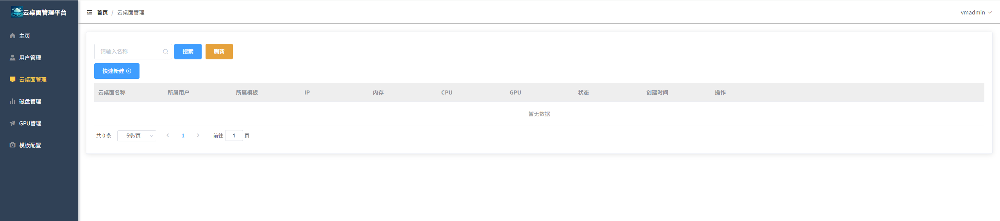
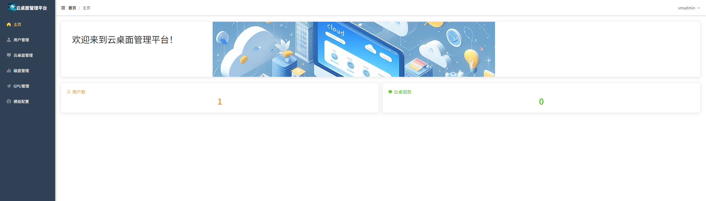

# 云桌面管理平台

云桌面管理平台是一个用于管理和访问基于windows hyper-v虚拟化的RDP云桌面的综合解决方案，包括服务器端、Web前端和客户端应用程序。本平台允许用户创建、管理和连接到虚拟云桌面，支持GPU虚拟化分配、磁盘管理和用户权限控制。

## 项目结构

项目包含以下主要组件：

- **前端 (front)**: 基于Vue.js的Web管理界面
- **后端 (backend)**: 基于Go语言和Gin框架的服务器端
- **桌面客户端 (client)**: 基于PyQt5的Windows桌面应用
- **安卓客户端 (client_android)**: 基于uni-app的Android移动应用
- **部署工具 (deploy)**: 用于部署服务的脚本和配置文件

## 功能特性

- 用户管理：创建、修改和删除用户账户
- 云桌面管理：创建、启动、关闭和重启云桌面
- 硬件资源管理：分配和监控GPU资源、管理磁盘空间
- 远程连接：通过RDP协议连接到云桌面

## 组件说明

### 前端 (front)

前端基于Vue.js框架开发，使用Element UI作为UI组件库，提供了友好的Web管理界面。

**开发与部署:**
- 开发环境: `npm run serve`
- 构建部署: `npm run build`

### 后端 (backend)

后端使用Go语言和Gin框架开发，提供RESTful API接口。

**开发与部署:**
- 开发环境: `go run main.go`
- 构建部署: `go build -o cloud_server_main.exe`

### 桌面客户端 (client)

桌面客户端使用Python和PyQt5开发，提供Windows桌面应用程序界面。

**主要文件:**
- `main.py`: 主程序入口
- `request_operate.py`: 网络请求处理
- `Ui_login.py`: 登录界面
- `Ui_main.py`: 主界面
- `Ui_config.py`: 配置界面
- `Ui_password.py`: 密码修改界面

**功能:**
- 登录验证
- 云桌面列表显示
- 云桌面操作（开机、关机、重启）
- 远程连接到云桌面
- 修改用户密码

### 安卓客户端 (client_android)

安卓客户端基于uni-app框架开发，可构建成Android应用，需要安装rdp8.0客户端。

## 部署说明

### 前端部署

1. Windows上安装nginx
   - 将nginx拷贝到指定目录C:\nginx
2. 将编译后的dist目录下的文件拷贝到nginx目录下的html目录
3. 启动nginx，打开powershell执行命令: `start nginx`
4. 其他命令:
   - 停止nginx: `./nginx.exe -s stop`
   - 重新加载配置: `./nginx.exe -s reload`

### 后端部署

1. Windows上安装nssm
   - 将nssm.exe拷贝到指定目录C:\nssm
   - 将C:\nssm路径添加到系统路径Path下
2. Windows上安装cloud_server
   - 将发布文件（cloud_server_main.exe, script, settings.yaml）拷贝到指定目录C:\cloud_server
   - 以管理员身份打开powershell，执行命令: `nssm install cloud_server_main C:\cloud_server\cloud_server_main.exe`
   - 启动cloud_server服务，执行命令: `nssm start cloud_server_main`
3. 其他命令:
   - 停止服务: `nssm stop cloud_server_main`
   - 移除服务: `nssm remove cloud_server_main`

## 系统要求

- **前端**: 现代Web浏览器（Chrome、Firefox、Edge等）
- **后端**: Windows操作系统
- **桌面客户端**: Windows操作系统，支持Python 3.6+
- **安卓客户端**: Android 5.0+